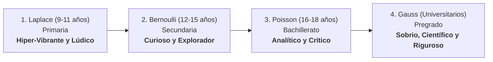
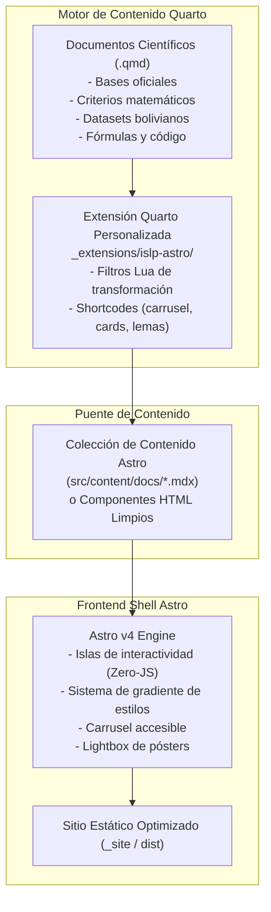

# Especificación Técnica y de Experiencia de Usuario (UX/UI)
## Rediseño del Sitio Web de la Competencia Boliviana de Pósters Estadísticos (ISLP Bolivia)

**Versión:** 2.0.0  
**Fecha:** Septiembre 2026  
**Framework Base:** [Quarto](https://quarto.org/) (v1.9+) + [Astro](https://astro.build/) (v4+) vía Extensión Personalizada  
**Despliegue Objetivo:** GitHub Pages mediante `.github/workflows/publish.yml` (Acción Oficial de Quarto)  
**Audiencia Principal:** Estudiantes de Bolivia (Primaria, Secundaria, Bachillerato y Universidad) y sus Docentes Tutores  

---

## 1. Visión y Diagnóstico

### 1.1 Visión del Proyecto
Transformar el sitio web de **ISLP Bolivia** en un **portal de alto impacto, ultra-optimizado y centrado en el estudiante**, que despierte el entusiasmo por la ciencia de datos, el pensamiento crítico y la investigación en Bolivia. El sitio acompaña la *Quinta Versión (2026–2027)* con una experiencia de usuario que evoluciona desde un entorno lúdico y vibrante para niños de primaria, hasta una atmósfera sobria, rigurosa y académica para estudiantes universitarios.

### 1.2 Cuadro Comparativo de Evolución Tecnológica

| Dimensión | Estado Anterior (Jekyll / Bootstrap 3) | Nueva Arquitectura (Quarto + Extensión Astro) |
|---|---|---|
| **Motor de Render** | Ruby / Jekyll 3.9 heredado de 2016, dependencias obsoletas. | **Quarto v1.9+** para rigor de contenido + **Astro** para frontend ultrarrápido con arquitectura de islas (Zero-JS). |
| **Experiencia de Categorías** | Estilo uniforme y plano sin distinción etaria. | **Gradiente de personalidad visual:** de hiper-vibrante y lúdico (Laplace) a sobrio y riguroso (Gauss). |
| **Galería de Pósters** | Enlaces dispersos a PDFs de 10 MB que rompen en móviles. | **Galería con Carrusel interactivo y Tarjetas de Casos de Estudio** con lemas inspiradores y vista ampliada. |
| **Plantillas y Recursos** | Archivos pesados en el repositorio sin vista previa. | **Enlaces externos a almacenamiento en la nube (Google Drive y Canva)** en cards informativas de alta usabilidad. |
| **Automatización CI/CD** | Builds manuales o dependientes de Jekyll GitHub Pages. | **GitHub Actions (`.github/workflows/publish.yml`)** con la acción oficial de Quarto hacia la rama `gh-pages`. |
| **Accesibilidad y UX** | Modales inaccesibles, bajo contraste (WCAG C). | **WCAG 2.2 Nivel AA**, navegación por teclado, contraste verificado y tiempos de carga instantáneos. |

---

## 2. Gradiente de Personalidad Visual: "De lo Vibrante a lo Sobrio"

El portal adopta una transición estilística progresiva según el nivel educativo y la edad del participante:



### 2.1 Categoría Laplace (9 a 11 años · Primaria) — *Vibrante y Lúdico*
* **Atmósfera:** Alegre, exploratoria, con elementos que invitan al juego y al descubrimiento.
* **Paleta:** Azul cielo eléctrico (`#0284c7`), amarillo sol radiante (`#f59e0b`) y blanco puro con sombras coloridas suaves.
* **Tipografía:** Redondeada, amigable y acogedora (`Outfit` con pesos amables).
* **Elementos UI:** Badges tipo sticker, íconos de animales o lupas, bordes redondeados (`border-radius: 18px`), lenguaje directo ("¡Haz preguntas sobre tus juegos, mascotas o el recreo!").

### 2.2 Categoría Bernoulli (12 a 15 años · Secundaria) — *Curioso y Explorador*
* **Atmósfera:** Dinámica, orientada al trabajo en equipo y al descubrimiento de patrones del entorno.
* **Paleta:** Verde esmeralda fresco (`#10b981`), cian energético (`#06b6d4`) y azul moderno (`#2563eb`).
* **Tipografía:** Moderna y ágil (`Plus Jakarta Sans`).
* **Elementos UI:** Tarjetas interactivas con hover activo, microinteracciones y preguntas enfocadas en la comunidad, el deporte y la tecnología escolar.

### 2.3 Categoría Poisson (16 a 18 años · Bachillerato) — *Analítico y Crítico*
* **Atmósfera:** Madura, orientada al pensamiento crítico, debates sociales y preparación preuniversitaria.
* **Paleta:** Naranja cálido profundo (`#ea580c`), azul acero (`#1e40af`) y neutros fríos (`#334155`).
* **Tipografía:** Balance entre estructura geométrica y seriedad editorial.
* **Elementos UI:** Tablas comparativas de datos, citas de fuentes confiables, énfasis en formulación de hipótesis e impacto comunitario.

### 2.4 Categoría Gauss (Universitarios de Pregrado) — *Sobrio, Científico y Riguroso*
* **Atmósfera:** Academia de alto nivel, rigor metodológico, data science y publicación científica.
* **Paleta:** Púrpura profundo / índigo medianoche (`#1e1b4b`, `#312e81`), grafito oscuro (`#0f172a`) y gris pizarra (`#64748b`).
* **Tipografía:** Sobria y precisa, con soporte para números tabulares y código monospace (`JetBrains Mono`).
* **Elementos UI:** Estructura tipo paper científico, métricas de significancia, visualizaciones avanzadas (R/Python), enlace al World Statistics Congress del ISI.

---

## 3. Galería Interactiva: Carrusel y Casos de Estudio con Lemas

La galería de la competencia deja de ser una lista estática de archivos y se transforma en un **Hall de Inspiración**:

### 3.1 Carrusel Destacado de Pósters
* Componente responsivo con deslizamiento suave (touch-swipe en móviles y botones accesibles en escritorio).
* Muestra los pósters más premiados de las cuatro ediciones anteriores (2018–2025).
* Vista previa con efecto lightbox para examinar texto y visualizaciones sin perder resolución.

### 3.2 Tarjetas de Casos de Estudio con Lemas Inspiradores
Cada tarjeta de póster premiado incluye una estructura narrativa de caso de estudio:

```markdown
┌──────────────────────────────────────────────────────────────┐
│  [IMAGEN PÓSTER CON LIGHTBOX / ZOOM]                         │
├──────────────────────────────────────────────────────────────┤
│  🏆 1.er Lugar Nacional — Categoría Poisson (Edición 2022)   │
│  "De una encuesta en el recreo a representar a Bolivia"      │  <-- LEMA
├──────────────────────────────────────────────────────────────┤
│  PROYECTO: "Impacto del uso de dispositivos en el sueño"    │
│  EQUIPO: Los Exploradores de Datos (3 estudiantes + 1 tutor) │
│  COLEGIO / SEDE: Unidad Educativa San Calixto · La Paz       │
├──────────────────────────────────────────────────────────────┤
│  💡 ¿POR QUÉ GANÓ ESTE TRABAJO?                             │
│  • Formulación impecable de la pregunta de investigación.    │
│  • Gráficos con títulos descriptivos y fuentes claras.       │
│  • Conclusiones accionables y honestidad metodológica.       │
├──────────────────────────────────────────────────────────────┤
│  [ Ver Ficha Completa ]          [ Descargar Ficha PDF ]     │
└──────────────────────────────────────────────────────────────┘
```

---

## 4. Almacenamiento Externo de Plantillas y Recursos

Para no sobrecargar el repositorio git con binarios pesados (`.pptx`, `.psd`, `.zip`), todas las plantillas se alojan en repositorios y almacenamientos externos de alta disponibilidad:

1. **Google Drive Oficial ISLP Bolivia:**
   * Carpetas compartidas públicas organizadas por categoría y año.
   * Archivos descargables:
     * `Plantilla_Oficial_A1_PowerPoint.pptx` (con guías de márgenes a 300 DPI).
     * `Kit_Graficos_y_Logos_Oficiales.zip` (logos en alta resolución de ISLP, ARU, UMSA, ISI).
     * `Guia_Elaboracion_Poster_ISLP.pdf`.
2. **Canva Template Direct Links:**
   * Enlaces directos a plantillas públicas con permiso de duplicación en Canva.
   * Permite a estudiantes de primaria y secundaria editar directamente en su navegador o tablet sin necesidad de instalar software.
3. **Repositorios de Código (Quarto / Typst / LaTeX):**
   * Enlace a repositorio GitHub con plantilla Quarto lista para clonar (`quarto use template ...`) para la categoría Gauss.

---

## 5. Arquitectura Híbrida: Extensión Personalizada de Quarto + Astro

Para responder a la necesidad de máxima optimización y profesionalismo visual:



### 5.1 Estructura de la Extensión Quarto (`_extensions/islp-astro/`)
La extensión personalizada se ubica en el proyecto y aporta:
* `_extension.yml`: Registro de metadatos, filtros Lua y shortcodes.
* `islp-shortcodes.lua`:
  * ``: Genera el bloque estilizado de lema con tipografía de exhibición.
  * ``: Genera tarjetas de descarga directa vinculadas a Google Drive.
  * ``: Inserta la ficha interactiva del póster ganador.
* `quarto-astro-filter.lua`: Pandoc filter que normaliza metadatos y estructura el DOM para ser hidratado de forma ultrarrápida por los componentes de Astro.

### 5.2 Beneficios de la Integración Quarto + Astro
* **Rendimiento insuperable:** Lighthouse 100/100 en Performance y SEO gracias al modelo de islas de Astro.
* **Rigor y autoría amigable:** Los organizadores de ISLP editan simples archivos `.qmd` o Markdown con sintaxis estándar de Quarto.
* **Cero dependencias Ruby:** Eliminación definitiva de Jekyll y Gemfiles.

---

## 6. Despliegue Automatizado en GitHub Pages (`.github/workflows/publish.yml`)

El flujo de integración continua oficial de Quarto se optimiza y estandariza para publicar a la rama `gh-pages`:

```yaml
name: Quarto & Astro Publish to GitHub Pages

on:
  workflow_dispatch:
  push:
    branches:
      - main
      - master

permissions:
  contents: write
  pages: write
  id-token: write

concurrency:
  group: "pages"
  cancel-in-progress: false

jobs:
  build-deploy:
    runs-on: ubuntu-latest
    steps:
      - name: Clonar repositorio
        uses: actions/checkout@v4
        with:
          fetch-depth: 0

      - name: Configurar Node.js
        uses: actions/setup-node@v4
        with:
          node-version: 20
          cache: 'npm'

      - name: Instalar dependencias frontend
        run: npm ci || npm install

      - name: Configurar Quarto CLI
        uses: quarto-dev/quarto-actions/setup@v2
        with:
          version: "1.9.37"

      - name: Renderizar documentos Quarto
        run: quarto render

      - name: Compilar frontend optimizado Astro
        run: npm run build

      - name: Publicar en GitHub Pages mediante Quarto Action
        uses: quarto-dev/quarto-actions/publish@v2
        with:
          target: gh-pages
        env:
          GITHUB_TOKEN: ${{ secrets.GITHUB_TOKEN }}
```

---

## 7. Plan de Ejecución y Migración

1. **Fase 1: Infraestructura y Extensión Quarto**
   * Configurar `_quarto.yml` con la estructura del sitio y metadatos de la 5ª versión.
   * Crear la extensión personalizada `_extensions/islp-astro/` (filtros Lua y shortcodes para lemas, carrusel y descargas de Drive).
   * Corregir y verificar el workflow de CI en `.github/workflows/publish.yml`.
2. **Fase 2: Sistema de Diseño con Gradiente de Personalidad**
   * Implementar los estilos CSS/SCSS con tokens para las 4 categorías (Laplace → Bernoulli → Poisson → Gauss).
   * Diseñar los componentes del carrusel y las tarjetas de casos de estudio.
3. **Fase 3: Contenidos de la 5ª Versión y Toolkit**
   * Redactar páginas de competencia (`bases.qmd`, `categorias.qmd`, `criterios.qmd`, `cronograma.qmd`).
   * Crear el Student Toolkit (`recursos/`) con tarjetas a Google Drive y Canva.
4. **Fase 4: Galería de Pósters y Boletines Históricos**
   * Migrar los registros de las 4 versiones previas con imágenes optimizadas y fichas de lemas.
5. **Fase 5: Pruebas, Accesibilidad y Publicación**
   * Verificación local con `quarto render` y pruebas Lighthouse.
   * Despliegue en `gh-pages` vía GitHub Actions.
